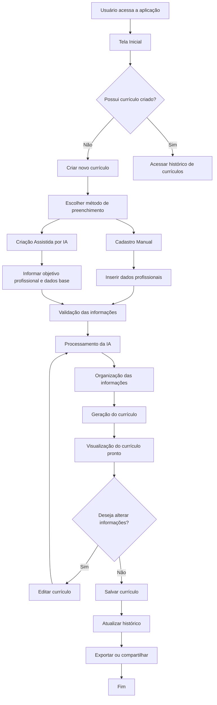

# Fluxo do Sistema

## Visão Geral

O sistema tem como objetivo auxiliar profissionais na criação de currículos personalizados utilizando Inteligência Artificial.

A aplicação permite cadastrar informações profissionais, gerar um currículo estruturado, visualizar o resultado final e manter o histórico das versões criadas.

O fluxo foi desenvolvido considerando uma experiência simples para o usuário, desde o preenchimento das informações até a geração do documento final.

---

# Fluxo Principal da Aplicação

---

# Detalhamento das Etapas

## 1. Tela Inicial

A aplicação apresenta ao usuário as opções disponíveis:

- Criar um novo currículo;
- Consultar currículos existentes;
- Continuar uma edição anterior.

O sistema deve apresentar informações reais dos currículos cadastrados, evitando registros duplicados ou informações genéricas.

---

# 2. Criação do Currículo

O usuário pode iniciar um novo currículo utilizando duas opções:

## Cadastro Manual

Permite o preenchimento direto das informações:

- Dados pessoais;
- Resumo profissional;
- Experiências profissionais;
- Formação acadêmica;
- Competências;
- Objetivos profissionais.

---

## Criação Assistida por IA

A inteligência artificial auxilia o usuário na construção do currículo.

A IA pode apoiar:

- Organização das informações;
- Melhoria da descrição profissional;
- Adequação da linguagem;
- Estruturação compatível com processos seletivos.

---

# 3. Processamento das Informações

Após o preenchimento, o sistema realiza:

- Validação dos dados;
- Organização das informações;
- Aplicação das regras de geração;
- Preparação do currículo final.

---

# 4. Visualização do Currículo

O usuário visualiza o currículo antes da exportação.

A visualização deve representar exatamente o documento final gerado.

Regras importantes:

- A impressão deve considerar somente o currículo pronto;
- Não devem ser incluídos elementos da tela de edição;
- O layout apresentado deve ser preservado na exportação.

---

# 5. Histórico de Currículos

O sistema mantém o histórico dos currículos criados.

Cada registro deve apresentar:

| Informação | Descrição |
|---|---|
| Nome do currículo | Identificação do documento criado |
| Data de criação | Quando foi gerado |
| Última atualização | Última alteração realizada |
| Status | Situação atual do currículo |

---

# 6. Armazenamento

Os dados gerados devem permanecer disponíveis para consultas futuras.

O armazenamento permite:

- Recuperar currículos anteriores;
- Editar versões existentes;
- Criar novos modelos;
- Manter rastreabilidade das alterações.

---

# Fluxo de Dados

---

# Regras de Negócio

- Cada currículo criado deve possuir identificação própria.
- Currículos inexistentes não devem aparecer no histórico.
- Registros duplicados com o mesmo nome devem ser evitados.
- O histórico deve apresentar somente informações reais cadastradas.
- Alterações realizadas devem atualizar o registro correspondente.
- A exportação deve utilizar somente a versão final aprovada pelo usuário.

---

# Possíveis Evoluções

O projeto pode evoluir com:

- Agente de IA para análise de vagas;
- Comparação currículo x descrição da vaga;
- Avaliação de compatibilidade ATS;
- Sugestão automática de melhorias;
- Integração com plataformas de recrutamento;
- Assistente para preparação de entrevistas.

---

# Objetivo do Fluxo

O fluxo representa uma solução baseada em IA para facilitar a criação de currículos profissionais, unindo automação, inteligência artificial e organização das informações profissionais do usuário.
