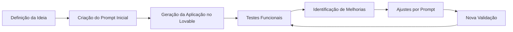

# Prompt Lovable

## Visão Geral

Este documento apresenta a abordagem utilizada para desenvolvimento do projeto **Gerador de Currículos ATS Friendly com Lovable**, utilizando técnicas de **Engenharia de Prompt**, **IA Generativa** e **Vibe Coding**.

O desenvolvimento foi realizado por meio de ciclos iterativos, onde cada etapa utilizou prompts específicos para criação, validação, correção e evolução das funcionalidades da aplicação.

---

# Estratégia de Desenvolvimento

O desenvolvimento seguiu o processo:

---

# Prompt Inicial

## Objetivo

Criar uma aplicação para geração de currículos profissionais compatíveis com sistemas ATS.

## Principais definições utilizadas:

* Criar uma interface moderna e intuitiva.
* Permitir cadastro manual de currículo.
* Permitir importação de currículo existente.
* Criar visualização em tempo real.
* Permitir gerenciamento de histórico.
* Exportar currículo em PDF.
* Utilizar estrutura ATS Friendly.

---

# Prompt de Estruturação Funcional

## Objetivo

Definir o comportamento da aplicação.

Foram especificadas regras como:

* Organização das etapas do cadastro.
* Campos necessários para o currículo.
* Estrutura do histórico.
* Funcionamento da edição.
* Funcionamento da exclusão.
* Atualização automática das informações.

---

# Prompt de Melhorias de Interface

## Objetivo

Aprimorar a experiência do usuário.

Foram solicitados ajustes relacionados a:

* Organização dos campos.
* Melhor visualização do currículo.
* Melhor navegação entre etapas.
* Melhor apresentação das informações.

---

# Prompt de Correção do Histórico

## Objetivo

Corrigir inconsistências encontradas durante os testes.

Ajustes realizados:

* Exibir corretamente o nome do candidato.
* Diferenciar nome do currículo e nome da pessoa.
* Evitar registros duplicados.
* Atualizar corretamente a data de alteração.

---

# Prompt de Ajuste da Exportação

## Objetivo

Garantir que o PDF gerado representasse somente o currículo final.

Correções solicitadas:

* Remover menus da aplicação.
* Remover botões.
* Ajustar área de impressão.
* Manter estrutura ATS Friendly.

---

# Prompt de Validação Final

## Objetivo

Realizar uma revisão geral da aplicação.

Itens avaliados:

* Fluxo de criação do currículo.
* Cadastro manual.
* Importação.
* Histórico.
* Preview.
* Exportação.
* Experiência do usuário.

---

# Boas Práticas Utilizadas

Durante o desenvolvimento foram aplicadas práticas de:

## Engenharia de Prompt

* Definição clara do objetivo.
* Descrição das regras de negócio.
* Separação de funcionalidades.
* Validação após cada alteração.

## Vibe Coding

* Desenvolvimento colaborativo com IA.
* Evolução incremental da aplicação.
* Testes contínuos.
* Refinamento por ciclos de melhoria.

---

# Aprendizados

O desenvolvimento demonstrou que ferramentas de IA podem auxiliar na criação de aplicações completas quando combinadas com:

* Pensamento analítico.
* Definição de requisitos.
* Conhecimento de processos.
* Testes e validações.
* Documentação adequada.

---

# Próximas Evoluções

Possíveis melhorias futuras utilizando IA:

* Análise automática de aderência à vaga.
* Sugestão de palavras-chave ATS.
* Geração de resumo profissional personalizado.
* Comparação entre currículo e descrição da vaga.
* Assistente de carreira integrado.
